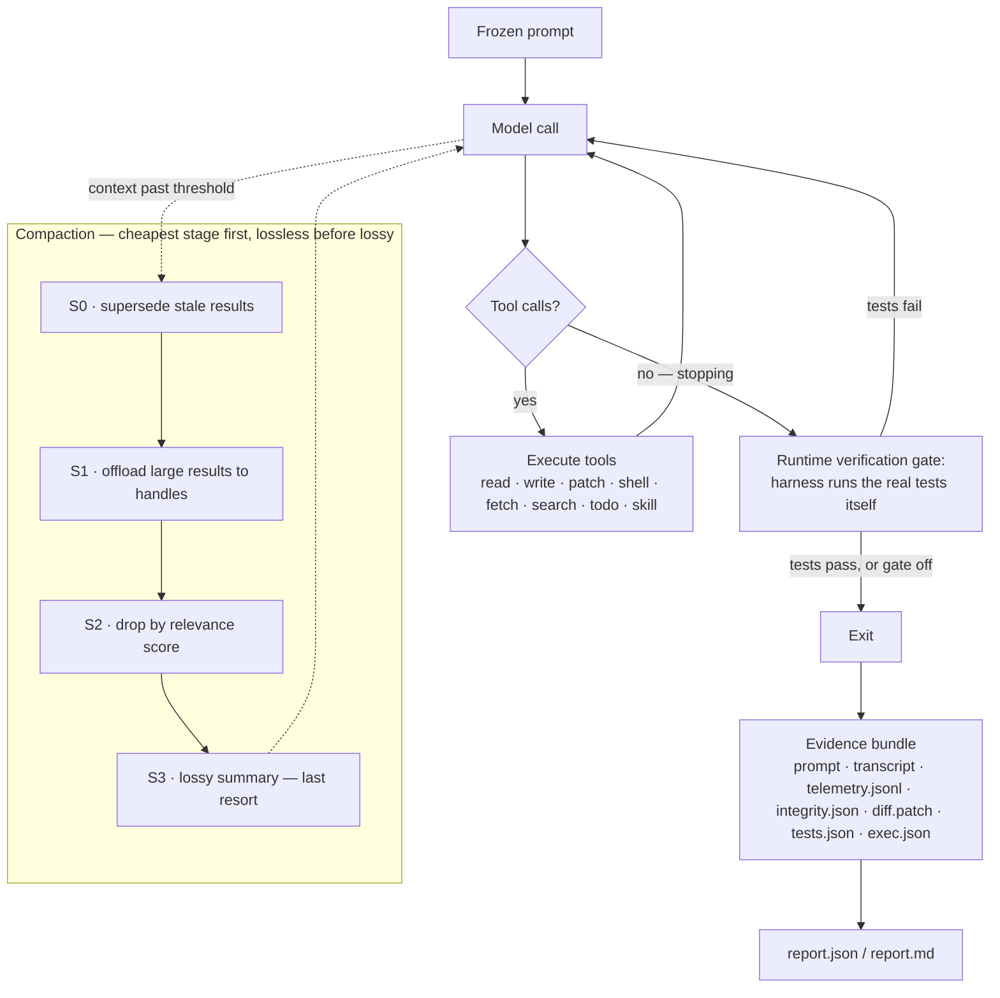
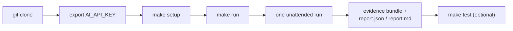

<p align="center">
  
</p>

<h1 align="center">Peach Ice Tea</h1>

<p align="center">
  A coding-agent harness for the LCC × DevClub AI Coding Harness Hackathon:<br>
  one frozen prompt, one unattended run, and an evidence bundle judges can check without taking our word for anything.
</p>

What we built, and why, is in [`documentation/ARCHITECTURE.md`](documentation/ARCHITECTURE.md) and
`docs/harness/DECISIONS.md`.

[What the harness adds](#what-the-harness-adds) ·
[How one run works](#how-one-run-works) ·
[Setup](#setup) ·
[Running a task](#running-a-task) ·
[Evaluating locally](#evaluating-locally) ·
[Layout](#layout-hackathon-32) ·
[Configuration](#configuration) ·
[Design decisions](#major-design-decisions) ·
[Limitations](#known-limitations) ·
[Provenance](#provenance)

## What the harness adds

| Area | What it does | Where |
|---|---|---|
| Test integrity | Refuses edits to protected tests at dispatch (tools and shell), verifies them after the run, and restores anything changed | `crates/peach_harness/src/integrity/` |
| One-shot autonomy | Never waits for a person; wall-clock budget; SIGTERM/SIGINT still write the evidence | `crates/peach_main/src/harness_exec.rs` |
| Verified completion | Test detection and classification; a runtime gate that runs the real tests when the model tries to stop and sends failures back (on by default: Kimi 0/6 → 5/6, no cost to a model that already verifies, D-088/D-099); recovery hints; the harness's own final test run | `crates/peach_harness/src/verify/` |
| Staged compaction | Cheapest stage first: supersede stale results (S0), offload large ones to recall handles readable with `read` (S1), drop by relevance score (S2), lossy summary only as a last resort (S3); an append-only event log replays the pre-compaction context | `crates/peach_app/src/compaction_pipeline/`, `crates/peach_repo/src/thread_event/` (D-062..D-077) |
| Model failover | An exhausted quota or an outage that outlasts retries switches to the next model in `PEACH_HARNESS_FALLBACK_MODELS` instead of ending the run; a malformed request does not fail over | `crates/peach_app/src/model_failover.rs` (opt-in, D-072/D-081) |
| Doom-loop escalation | An identical repeated call is warned, then withheld, then pauses the run (exit 6); upstream's cycle nudge is kept alongside | `crates/peach_app/src/doom_loop_escalation.rs` (flag: `PEACH_HARNESS_DOOM_LOOP_ESCALATION`, off; D-082) |
| Compact tool docs | Tool descriptions without worked examples: −6.6% / −17.6% input tokens with no success loss on two families | `crates/peach_harness/src/tool_docs.rs` (on by default, D-085) |
| Telemetry | JSONL events with provider-reported tokens, retries (with billed usage), tool/model correlation, compaction, tests, integrity; redacted before disk | `crates/peach_harness/src/telemetry/`, `crates/peach_app/src/hooks/telemetry.rs` |
| Evidence + report | Prompt, transcript, telemetry, integrity, diff, tests, `exec.json`, `report.json`/`report.md` and a checksum manifest on every exit path | `crates/peach_harness/src/{evidence,report}.rs` |
| Provider robustness | Gemini thinking level, DeepSeek cache accounting, fail-fast on quotas that cannot recover | `crates/peach_repo/src/provider/`, `crates/peach_domain/src/provider_quota.rs` |
| Degenerate-reply retry | A reply with no text, no tool call, and only a repeated symbol as reasoning is retried, not accepted as "done" — caught a real model returning `!` × 32 and being scored as success (D-096) | `crates/peach_domain/src/result_stream_ext.rs` (flag: `PEACH_HARNESS_DEGENERATE_RETRY`, on by default; Kimi 2/6 → 6/6, D-100) |
| Difficulty-driven reasoning | Every run starts at low reasoning effort; escalates once, to high (optionally a stronger model), only on a signal the task is hard — a failing test run, the verify gate catching a stop, repeated tool errors, or a long call count | `crates/peach_app/src/reasoning_budget.rs` (flag: `PEACH_HARNESS_REASONING_SCHEDULE`, off pending its A/B; D-097) |
| Pluggable external scorer | The compaction stage that decides what old tool output to keep can call an outside command in a documented protocol, so a JEV-style scorer plugs in without the harness depending on it; a dropped result goes to a readable file, never deleted | `docs/harness/SCORER_PROTOCOL.md` (D-098) |
| Local web UI | `make ui`: a React app — run a task, watch it live with a scrubbable trace/waterfall replay, browse evidence and A/B reports | `harness/ui/app/` (D-092, rewritten D-101/D-102) |

## How one run works



A test-integrity guard runs alongside every step: it captures a manifest of protected test files before the
run starts, refuses any edit to them at tool or shell dispatch, and verifies and restores them after — including
after the harness's own final test run, since a suite can write files of its own.

## Setup

Requirements: Rust (pinned by `rust-toolchain.toml`; `make setup` installs it with rustup if missing), `protoc`
(D-009; installed with Homebrew if missing, otherwise `apt-get install protobuf-compiler`), Node 22+.

```bash
git clone <this repository> && cd <it>
export AI_API_KEY=...        # the only credential; environment only, never written anywhere
make setup                   # release build → target/release/peach, npm deps, layout check
```

## Running a task

The evaluator interface is the root `Makefile` (MAKEFILE_EVAL.md, D-070):



`make run` takes the issue from stdin
(piped, or typed and ended with Ctrl-D) or from `PROMPT=`, and runs it once, unattended, in the repository named by
`REPO` (by default the directory `make` was invoked from; it refuses to work on the harness itself):

```bash
make run REPO=/path/to/repository < issue.md
make run REPO=/path/to/repository PROMPT="Fix the failing test in stats.py"
cd /path/to/repository && make -f /path/to/harness/Makefile run    # REPO defaults to here
```

A model the Organising Committee prescribes is set with `make run MODEL=<model id>` or `PROFILE=<name>` — a
variable, never a source change (MAKEFILE_EVAL.md §4). `AI_API_KEY` is then handed to that profile as the provider
variable it expects. Without either set, the key's own shape picks a profile as a convenience (D-081): an AI Studio
key (`AIza…`) → `gemini`, an OpenRouter key (`sk-or-…`) → `openrouter`, anything else → `gemini` as the fallback.
Optional: `TEST_COMMAND=` (otherwise detected), `EVIDENCE_DIR=` (default `evidence/<UTC time>/`),
`MAX_DURATION_SECS=` (default 1800). `make test` runs the local hackathon suite live; `make check` runs the
offline checks (no key, no model); `make clean` removes build output and evidence.

Underneath, `make run` calls the entry point `harness/peach-ice-tea`, which can also be used directly from the
repository to work on:

```bash
OPENROUTER_API_KEY=... harness/peach-ice-tea --profile openrouter --evidence-dir /path/outside/the/repo \
  --test-command "python3 -m unittest discover -s tests -t . -v" --prompt-file issue.md
```

The last stdout line is the JSON outcome. Exit codes: 0 completed, 1 error, 2 tool-failure limit, 3 request
limit, 4 time budget, 5 interrupted, 6 doom-loop escalation (flagged, D-082). `peach report <evidence-dir>` regenerates the report offline.

**`make ui`** starts a local web UI (React app, `harness/ui/app/`; D-092, rewritten D-101/D-102) as an
alternative to the command line: start a task, watch it run live — with a scrubbable trace/waterfall replay
of the telemetry, not just a plain list — against the same `harness/run-task` entry point `make run` uses, and
browse past evidence bundles and benchmark reports. Loopback-only; provider keys never reach the browser. The
first `make ui` runs `npm install`/`npm run build` in `harness/ui/app` automatically; `make ui-build` forces a
rebuild after editing its source, `make ui-dev` runs Vite's own dev server with hot reload. None of this is
required for `make run`, which never needs Node beyond `make setup`'s own use of it.

## Evaluating locally

```bash
npm run hackathon -- --agent reference             # fixtures solve; runner check is green
npm run hackathon -- --agent peach-cheat           # proves peach's own integrity guard (no model, no spend)
OPENROUTER_API_KEY=... npm run hackathon -- --agent peach --profile openrouter --max-requests 60 --max-duration-secs 1500
```

`cargo insta test --workspace` runs the full suite (≈2,940 tests), including end-to-end tests of the real
binary against a scripted model.

## Layout (HACKATHON §32)

| Path | Contents |
|---|---|
| `Makefile` | Evaluator interface: `setup`, `run`, `test`, `check`, `clean` (D-070) |
| `harness/` | Entry point (`peach-ice-tea`), `run-task` (what `make run` calls), the local web UI (`ui/`), build and layout scripts |
| `crates/` | The harness itself (Rust workspace; stays here for upstream merges, D-021) |
| `telemetry/` | Where the organizers' telemetry files will be vendored; describes our internal stream |
| `reporting/` | Where the organizers' reporting files will be vendored; describes our report |
| `configuration/` | Prompt template and provider profiles (keys never stored) |
| `documentation/` | Architecture (§25 answers) and upstream's README |
| `benchmarks/hackathon/` | Local hackathon-shaped suite and runner |
| `docs/harness/` | Spec, research, plan, task list and the decision log |

## Configuration

Provider profiles and feature flags are listed in [`configuration/README.md`](configuration/README.md). The model
is never fixed in source: whatever the Organising Committee prescribes at evaluation time is set with
`MODEL=<model id>` or `PROFILE=<name>` (MAKEFILE_EVAL.md §4) — both read from the environment, no code change
either way (D-049). Without either set, `make run` infers a profile from `AI_API_KEY`'s own shape as a convenience
(D-081): an AI Studio key (`AIza…`) → `gemini`, an OpenRouter key (`sk-or-…`) → `openrouter`, anything else →
`gemini` as the fallback. `.env.example` shows the one variable the harness reads.

## Major design decisions

Enforce in the runtime, not in the prompt (D-019, D-031, D-037). Write evidence on every exit path
(D-034, D-038). Objective numbers only, with discrepancies shown rather than reconciled (D-035). Behaviour
changes stay behind default-off flags until an A/B supports them (D-039, D-041, D-042). The full log is
`docs/harness/DECISIONS.md`.

Where the A/Bs have landed so far:

| Change | Verdict | Evidence |
|---|---|---|
| Runtime verification gate | On | Kimi 0/6 → 5/6, Muse 6/6 → 6/6; no extra calls for the default model (D-088, D-099) |
| Degenerate-reply retry | On | Kimi 2/6 → 6/6; the pattern never occurs on 14 other models (D-100) |
| Compact tool docs | On | Input tokens down on two families, success unchanged (D-085) |
| Line numbers off in reads | Off, closed | Success flat, cost up on two families (D-093) |
| Noise compression | Off, closed | No benefit on GLM (D-094) |
| `write_note` scratchpad | Off | The model never used the tool (D-091) |
| Doom-loop escalation, reasoning schedule, parallel reads, tool correction, handoff note | Off, pending | A/Bs incomplete or confounded (D-082, D-093, D-097) |

## Known limitations

- The organizers' telemetry and report schemas are not published yet; the adapters are stubs (D-020).
- Shell edits are detected by a conservative command screen (redirects, `sed -i`, `mv`, `rm`, …); a write it
  doesn't recognise, such as one inside a script, doesn't arm the verify gate (D-045). Whenever a test command is known,
  the runtime gate still runs the tests at every stop.
- The title-generation model call is not metered.
- SIGKILL cannot be caught. A run killed that way keeps only what was written as it went: the prompt, streamed
  telemetry, a provisional `manifest.json` reading `incomplete`, and `integrity.baseline.json` with each test's
  pre-run hash and the location of its copy. There is no transcript, report or restore (D-038, D-056).
- A/Bs run on free tiers (D-069) at one or two seeds, so confidence intervals are wide; the verdicts above rest
  on large effects with a visible mechanism, not on narrow intervals. The graded model at evaluation time may
  not be one we measured.
- `make run` is one-shot: it takes one issue and exits. If the organisers want a harness that stays resident and
  takes several issues in one session, that is new scope (MAKEFILE_EVAL.md).

## Provenance

Peach Ice Tea is built on a fork of an open-source (Apache-2.0) Rust coding agent, forked
from upstream `304bf3b` (D-008; eligibility recorded in D-024). The upstream README is kept at
[`documentation/UPSTREAM_README.md`](documentation/UPSTREAM_README.md). The crates keep their `peach_*`
names so upstream merges stay possible (D-004). See [`LICENSE`](LICENSE) for the original license and
copyright.
