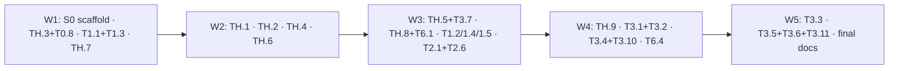

# Plan: Tier 1 and Tier 2 in five waves

I read HACKATHON, ALIGNMENT, DECISIONS (through D-023), TASKS, SPEC, RECON, DEV, CLAUDE.md and AGENTS.md, then checked the code at HEAD `1e56e371e` and later. Every path cited below was opened or grepped.

## Structure: 5 waves, one scaffold piece up front

Most of the new logic has no dependency on the upstream crates, so it goes into **one new crate, `crates/forge_harness`** (plain Rust, depends on `forge_domain` and `forge_config`). Every new `forge_app` module goes under **`crates/forge_app/src/harness/`**. Piece **S0** (Wave 1) does four things in one go:
- creates both of those with stub files and the final function signatures;
- adds every Cargo dependency the later pieces will need;
- adds the whole `harness` config section;
- wires behaviour-neutral **calls into the stubs** ("seams") inside the hot upstream files `app.rs`, `orch.rs` and `tool_registry.rs`.

After S0 lands, later pieces fill in bodies in files only they own. The hot files are edited once, which keeps D-004 merge cost low.

**Rules for every wave:**
- `docs/harness/TASKS.md` and `DECISIONS.md` are **orchestrator-only**. Pieces hand back tick lines, and decision text drafted as `D-NEW-<piece>-n`, which the orchestrator renumbers.
- `forge.schema.json` is generated by `crates/forge_config/tests/schema.rs`, which rewrites it when run locally. Only S0 regenerates it. After that, a config change is handed back and the orchestrator reruns `cargo test -p forge_config --test schema`.
- Any `Cargo.toml` edit after Wave 1 is handed back.
- Verify with `cargo check -p <crate>` and `cargo insta test -p <crate> --accept`. Never a release build.

---

## A. The waves

### WAVE 1 (4 pieces)

#### S0 — Scaffold, config and seams (no behaviour change) · Size M/L · no ticks (infrastructure)
**Hot files it owns in W1:** root `Cargo.toml`, `crates/forge_app/Cargo.toml`, `crates/forge_main/Cargo.toml`, `crates/forge_infra/Cargo.toml`, `crates/forge_config/src/{config.rs,lib.rs}`, `crates/forge_config/.forge.toml`, `forge.schema.json`, `crates/forge_app/src/lib.rs`, `crates/forge_app/src/app.rs`, `crates/forge_app/src/orch.rs`, `crates/forge_app/src/tool_registry.rs`.
**New files it owns:** all of `crates/forge_harness/**`, `crates/forge_config/src/harness.rs`, all of `crates/forge_app/src/harness/**`.

**Steps:**
1. **Create `crates/forge_harness`.** Workspace `members = ["crates/*"]` picks it up automatically.
   - Add `forge_harness = { path = "crates/forge_harness" }` to `[workspace.dependencies]`.
   - Add `forge_harness.workspace = true` to `forge_app`, `forge_main` and `forge_infra`.
   - Its own dependencies, all already in the workspace: `forge_domain`, `forge_config`, `serde`, `serde_json`, `schemars`, `anyhow`, `thiserror`, `chrono`, `sha2`, `glob`, `ignore`, `regex`, `similar`, `derive_setters`, `tokio` (fs, process), `tracing`. Dev: `pretty_assertions`, `insta`, `tempfile`.
2. **Write `forge_harness/src/lib.rs` with `pub mod` only and no `pub use`,** so nobody ever needs to edit it again. Modules: `identity`, `runtime`, `session`, `preamble`, `evidence_layout`, `evidence`, `redact`, `integrity` (dir: `mod.rs`, `globs.rs`, `manifest.rs`, `shell_guard.rs`, `mixed.rs`), `telemetry` (dir: `mod.rs`, `event.rs`, `sink.rs`, `organizer_adapter.rs`), `verify` (dir: `mod.rs`, `test_command.rs`, `failure_class.rs`), `report` (dir: `mod.rs`, `model.rs`, `render_md.rs`, `organizer_adapter.rs`).
3. **`identity.rs`, fully written. This is the single owner of the D-023 constant:**
   - `pub const HARNESS_NAME: &str = "peach-ice-tea";`
   - `pub const HARNESS_DISPLAY_NAME: &str = "Peach Ice Tea";`
   - `pub const HARNESS_VERSION: &str = env!("CARGO_PKG_VERSION");`
   - `pub const TELEMETRY_SCHEMA_ID = "peach-ice-tea.telemetry"`, `TELEMETRY_SCHEMA_VERSION = "0.1.0"`, `REPORT_SCHEMA_VERSION = "0.1.0"`, `EVIDENCE_LAYOUT_VERSION = "0.1.0"`.
   - `#[derive(Serialize, JsonSchema)] pub struct HarnessIdentity { name, version, build: Option<String> }`, where `build` comes from `option_env!("PEACH_ICE_TEA_BUILD")`, and `HarnessIdentity::current()`.
   - TH.4, TH.5 and TH.8 must use `HarnessIdentity::current()` and never the string literal. The only other place the slug may appear is the TH.9 wrapper's filename.
4. **`runtime.rs`, fully written.** A process-global `OnceLock<HarnessRuntime>`:
   - fields: `non_interactive: bool`, `run_id: String`, `repo_root: PathBuf`, `protected: Option<Arc<integrity::ProtectedSet>>`, `test_command: Option<verify::TestCommand>`, `sink: telemetry::Sink`, `config: HarnessConfig`;
   - functions: `install(rt)`, `get() -> Option<&'static HarnessRuntime>`, `non_interactive() -> bool` (false when nothing is installed).
   - It is global, rather than threaded through `Services`, so no upstream generic bounds change (D-004). Record this as a decision.
5. **`telemetry/event.rs`, fully written as data types. This is the shared contract.**
   - Envelope `{schema, schema_version, harness: HarnessIdentity, run_id, seq, ts (RFC 3339 ms), conversation_id?, agent_id?, parent_conversation_id?, type, data}`.
   - `enum TelemetryEvent` (serde tag `type`, snake_case):
     - `RunStart{prompt_sha256, model, provider, cwd, config_digest}`
     - `RunEnd{outcome, exit_code, wall_ms, metrics: TaskMetrics, termination_reason}`
     - `ModelCall{request_index, started_at, duration_ms, model, input_tokens, output_tokens, total_tokens, cached_tokens, reasoning_tokens, context_tokens_estimated, context_messages, finish_reason, tool_calls}`
     - `ToolCall{call_id, name, arguments, success, duration_ms, result_chars, result_summary, truncated, handle?}`
     - `Context{kind: compaction|prompt_composition, tokens_before?, tokens_after?, messages_before?, messages_after?, composition: BTreeMap<String,u64>}`
     - `AgentState{transition, detail}`
     - `Retry{attempt, cause, delay_ms}`
     - `Error{source, message}`
     - `Recovery{kind, trigger, action}`
     - `TestRun{command, exit_code, passed?, failed?, skipped?, duration_ms, failure_class?}`
     - `Integrity{phase: manifest|refusal|verify|restore, path?, detail}`
     - `InteractionSuppressed{site, default_taken}`
   - Token fields come only from provider `Usage` (HACKATHON §16). The one estimate is explicitly named `*_estimated`.
6. **`telemetry/mod.rs`:** `pub fn emit(ev: TelemetryEvent)` and `emit_scoped(ev, conversation_id, agent_id)`, both no-ops until TH.4. `sink.rs`: `pub enum Sink { Noop, Jsonl(JsonlSink) }` with a stub `JsonlSink`.
7. **Stubs with final signatures:**
   - `integrity`:
     - `ProtectedSet`, `Manifest::capture(root: &Path, cfg: &IntegrityConfig) -> anyhow::Result<Manifest>`
     - `ProtectedSet::from(&Manifest)`, `check_tool_path(&ProtectedSet, op: WriteOp, path: &Path) -> Option<String>`, returning the refusal text
     - `shell_guard::check_command(&ProtectedSet, cmd: &str) -> Option<String>`
     - `verify(&Manifest) -> IntegrityReport`, `restore(&Manifest, &IntegrityReport) -> IntegrityReport`, `model_notice(&ProtectedSet) -> Option<String>`
   - `verify`:
     - `test_command::detect(root: &Path, override_cmd: Option<&str>) -> Option<TestCommand>`, `model_notice(&TestCommand) -> Option<String>`, `is_test_command(&str, Option<&TestCommand>) -> bool`
     - `failure_class::classify(cmd, exit_code, stdout, stderr) -> Classification{class, passed, failed, skipped}`
     - `run_final(&TestCommand, timeout) -> Option<TestRunResult>`
   - `evidence::write_*` and `report::generate(dir: &Path) -> anyhow::Result<()>`.
   - `redact::redact_str(&str) -> Cow<str>`, identity for now.
   - `preamble::render(&HarnessRuntime) -> Option<String>`, returning None.
8. **`evidence_layout.rs`, fully written.** File-name constants: `prompt.txt`, `transcript.json`, `telemetry.jsonl`, `integrity.json`, `diff.patch`, `tests.json`, `exec.json`, `report.json`, `report.md`, `manifest.json`, and the `integrity/snapshot/` directory.
9. **`session.rs`, fully written as the orchestration skeleton.**
   - `ExecSession::begin(ExecSessionConfig{cwd, evidence_dir, prompt, harness: HarnessConfig, model, provider}) -> ExecSession` never fails. It: creates the evidence dir; writes `prompt.txt`; calls `Manifest::capture`, then `verify::detect`, then `runtime::install`, then emits `RunStart`. Each step is try-and-log (fail open).
   - `preamble() -> Option<String>`.
   - `finish(FinishInput{outcome, exit_code, error, metrics, conversation, related}) -> FinishSummary{evidence_dir, integrity}`. The order is fixed:
     1. integrity verify, then restore
     2. diff
     3. final test run
     4. transcript
     5. `exec.json`
     6. `RunEnd`
     7. report
     8. manifest
10. **`crates/forge_config/src/harness.rs`.** `HarnessConfig` holds `exec`, `integrity`, `telemetry`, `verify` and `features`. Add `pub harness: Option<HarnessConfig>` to `ForgeConfig`, following the `compact` pattern, register it in `lib.rs`, and add `[harness.*]` defaults to `.forge.toml`. The fields and defaults are designed now so later waves don't need to edit config:
    - **`exec`:** `max_wall_secs: Option<u64>`, default none; `finish_grace_secs = 30`.
    - **`integrity`:**
      - `enabled = true`, `interactive = false`
      - `on_violation = "restore" | "report"`, default restore (D-019 flag)
      - `protected_globs`: the R-HACK-2 defaults plus `**/__snapshots__/**` and `**/*.snap`
      - `extra_protected_globs = []`
      - `exclude_globs = [.git/**, node_modules/**, target/**, .venv/**, venv/**, **/__pycache__/**, **/*.pyc, .pytest_cache/**, dist/**, build/**, coverage/**]`
      - `mixed_files = [package.json, Cargo.toml, pyproject.toml, setup.cfg, tox.ini]`
    - **`telemetry`:** `enabled = true`, `max_argument_chars = 2000`, `max_result_summary_chars = 300`.
    - **`verify`:** `test_command` (optional), `enforce_green_after_edit = true`, `max_gate_nudges = 2`, `recovery_hints = true`, `final_test_run = true`, `final_test_timeout_secs = 600`.
    - **`features`** (all false; these are the A/B flags): `line_numbers_off`, `output_classifier`, `noise_compression`, `parallel_readonly_tools`, `tool_call_correction`, `compaction_supersede`, `compaction_offload`, `soft_compaction_trigger`, `project_memory`, `prompt_guidance`.
    - Add a test that `HarnessConfig::default()` equals the parsed `.forge.toml` section. RECON #5 pitfall: `Compact::default()` is a no-op config that doesn't match the toml. Then regenerate the schema.
11. **`crates/forge_app/src/harness/mod.rs`** declares these modules, each with a no-op body: `autonomy`, `integrity_guard`, `telemetry_hook`, `verify_gate`, `recovery`, `prompt_report`, `tool_correction`, `concurrency`, `compaction`. Add `mod harness;` to `forge_app/src/lib.rs`.
12. **Seams, each marked `// harness:`:**
    - **`app.rs`:**
      - Add `telemetry_hook::TelemetryHandler` to every one of the six hook chains. On `on_response`, add it after `CompactionHandler`.
      - Add `.and(verify_gate::VerifyGateHandler::new(forge_config.clone()))` to both `on_end` branches.
      - After the `SystemPrompt` step, call `prompt_report::record(&conversation, &tool_definitions)`.
    - **`tool_registry.rs` `call_inner`:**
      - Before `ToolCatalog::try_from(input)`: `let input = tool_correction::correct(input);`, which returns its input unchanged for now.
      - After the Task branch and before the permission check: `if let Some(out) = integrity_guard::check(&tool_input, &env.cwd) { return Ok(out); }`.
    - **`orch.rs`:**
      - Inside the retry closure: `telemetry_hook::on_retry(&agent_id, &model_id, error, duration)`.
      - After the error-tracker loop, before `append_message`: `recovery::annotate(&mut tool_call_records)`.
      - In `should_yield`, change to `…any(should_yield) && !autonomy::suppress_followup_yield()`, which returns false for now.
    - Add unit tests showing each seam is a no-op.

**Tests / acceptance:** `cargo check --workspace --all-targets`; `cargo insta test --workspace --accept` shows no snapshot changes (the 2705 baseline still passes); the config default-equality test passes.

**Hands back:** decision text (global runtime; seam architecture; the D-023 constant's location). Wait until the T0.2/T0.3 review fixes are merged before merging S0: T0.2 edited `orch.rs`.

**Reviewer checks:**
- `git diff` of `app.rs`, `orch.rs` and `tool_registry.rs` shows only seam lines, all with `// harness:`.
- No stub changes behaviour: the snapshot tests are byte-identical.
- `HarnessConfig::default()` matches `.forge.toml`.
- The string `"peach-ice-tea"` appears exactly once in `crates/`.
- `forge_harness` does not depend on `forge_app` (no cycle).
- `Sink::Noop` is the default and never panics.

#### W1-B — TH.3 Gemini first + T0.8 schema-rule test · Size M · **Tickable: T0.8; TH.3 partly** (see below)
**Owns:** `crates/forge_app/src/dto/google/{request.rs,response.rs}`, `crates/forge_app/src/utils.rs` (the Gemini sanitizer section only), the `#[cfg(test)]` module of `crates/forge_domain/src/tools/catalog.rs`, and a new `crates/forge_app/src/dto/google/schema_compat.rs`. Registration line to hand back: `mod schema_compat;` in `dto/google/mod.rs`. That file isn't hot, so W1-B may own it outright.

**What I found:**
- `response.rs:360-374` drops `thoughts_token_count`. `cached_content_token_count` is already mapped.
- `request.rs:397-408` always sends `thinking_level: None`, `thinking_budget: reasoning.max_tokens` and `include_thoughts: true`. `reasoning.effort` is ignored. The default config sets `effort = "medium"`.
- Tool schemas are generated with `inline_subschemas = true` (`catalog.rs:861-893`), so `$ref` never appears. Sanitization runs through `utils::sanitize_gemini_schema` (`utils.rs:626`), which removes `$schema`, `$defs`, `$ref`, `additionalProperties`, `title` and similar. It turns `const` into `enum`, type arrays into `nullable`/`anyOf`, and numeric enums into strings.
- **The sanitizer passes through `"format": "uint32"`,** which `fs_search` and others use (snapshot `forge_domain__tools__catalog__tests__tool_definition_json.snap:70-120`). Gemini's function-declaration Schema documents only `int32`/`int64` for INTEGER, `float`/`double` for NUMBER, and `enum`/`date-time` for STRING. An unsupported format risks a 400 on every request.
- `default` and `minimum` also survive. Both are supported in v1beta, but check them.

**Steps:**
1. **Usage.** `reasoning_tokens = thoughts`. `completion_tokens = candidates + thoughts`, so output tokens count thinking the same way the OpenAI-shaped providers do. Keep `total = total_token_count` and `cached = cached_content_token_count`. Update `test_usage_metadata_conversion` and add a streaming-merge test. Gemini sends cumulative `usageMetadata` per chunk; confirm `Usage::merge` takes the max, not the sum.
2. **Effort mapping.** Pure fn `thinking_for(model_id, &ReasoningConfig) -> Option<ThinkingConfig>`:
   - Gemini ≥ 3 (id starts `gemini-3`, or a newer major): use `thinking_level`, never together with `thinking_budget` (the API rejects both at once). Map `High | XHigh | Max → High`, `Medium → Medium`, `Low | Minimal → Low`. `None` sends no config, because Gemini 3 cannot disable thinking.
   - Gemini 2.x: use `thinking_budget`, with `None` meaning 0.
   - Add table tests.
3. **Sanitizer.** Drop unsupported `format` values: INTEGER keeps only int32/int64, NUMBER only float/double, STRING only enum/date-time. Keep `minimum`. Unit-test it.
4. **`schema_compat.rs` test.** For every `ToolCatalog::iter()` definition, plus a fixture MCP schema containing `oneOf`, `$ref`/`$defs`, `const`, a type array, `additionalProperties` and `format: uri`:
   - run `FunctionDeclaration::from`;
   - walk the result and assert only allowlisted Gemini Schema keys remain: `type`, `format`, `description`, `nullable`, `enum`, `properties`, `required`, `items`, `minItems`, `maxItems`, `minimum`, `maximum`, `minLength`, `maxLength`, `pattern`, `anyOf`, `default`, `propertyOrdering`, `minProperties`, `maxProperties`, `example`;
   - check formats against the table above;
   - check every `required` entry exists in `properties`;
   - snapshot the full Gemini declarations with insta.
5. **T0.8, in the `catalog.rs` tests module:**
   - **Flatness:** fail on any object schema with its own `required` below the root, except an explicit allowlist of today's nested cases (`multi_patch.edits[]`, `todo_write.todos[]`, `sem_search.queries[]`, and whatever else the worker finds). Any new nested required schema then fails the test.
   - **Ordering:** a documenting test that shows `required` currently comes *after* `properties` (snapshot lines 7 and 39). Record it as a decision: "R-TOOL-1 ordering is not implemented in OSS Forge. Its evidence is GPT-specific, so deferred."
6. **Unknown model ids.** Check how Forge behaves with a model id missing from `forge_repo/src/provider/provider.json` for `google_ai_studio`: `app.rs` `models.iter().find` sets the compaction threshold. Make an unknown id work with a 1M-context fallback, or document the id that has to be added. **Do not invent `gemini-3.8-*` ids.**
7. Leave `benchmarks/models.csv` alone (see C4).

**Tickable:** T0.8 yes. TH.3: tick the code parts. The requirement also says "verify every tool schema is accepted by Gemini", which needs one live call, so TH.3 stays unticked until a key exists. Hand back a note to that effect.

**Reviewer checks:**
- `thinking_level` and `thinking_budget` are never both set.
- A non-Gemini-3 model still gets a budget.
- `completion_tokens` isn't double-counted in `TaskMetrics.output_tokens`.
- The sanitizer change also applies to MCP tool schemas.
- Snapshot diffs change only `format` lines.
- `default: false` on booleans survives.
- Output-token cap: `max_tokens = 20480` (`.forge.toml`) counts thoughts under High thinking and can end turns with `MAX_TOKENS`. Report the recommended eval value (≥ 65536) to TH.9.

#### W1-C — T1.1 loud truncation + T1.3 recovery events · Size M · **Tickable: T1.1, T1.3**
**Owns:** `crates/forge_app/src/operation.rs`, `crates/forge_app/src/truncation/**`, `crates/forge_app/src/tool_executor.rs`, `crates/forge_domain/src/task_metrics.rs`, and the insta snapshots under `crates/forge_app/src/snapshots/`.

**Steps:**
1. **Audit every withholding site** and make each one say, in one plain sentence, how much was withheld and the exact call to get it back (R-OUT-4).
   - `FsRead` (`operation.rs:245`): ranged reads and the `max_read_lines` 2000 cap, plus per-line `max_line_chars` clipping. Check whether that clipping is silent today.
   - `FsSearch` (`:344-395`): current text is "Results truncated … use a more specific search pattern". It says neither the count withheld nor how to recover.
   - `NetFetch` (`:562-586`): already names the path. Normalise the wording.
   - `Shell` (`:588-620`, `truncate_shell.rs`): must name the temp file from `dump_operation` and the lines omitted.
   - Standard format: `… N more lines not shown. Full output: read <path> with a range.`
   - **MCP:** `tool_registry.rs:190-213` doesn't truncate at all. Add `truncation/truncate_mcp.rs` with `shape_mcp_output(ToolOutput, &ForgeConfig) -> ToolOutput`. S0 owns `tool_registry.rs`, so **hand back one line** for the MCP branch: `let output = crate::truncation::shape_mcp_output(output, &config);`.
2. **T1.3.**
   - Add `RecoveryEvents{offload_read, rerun_same_command, reread_same_range, first_error_recovered}` to `TaskMetrics`. Use `#[serde(default)]` so old conversations still deserialize.
   - Count them in `tool_executor.rs::execute` through `context.with_metrics`:
     - a read whose normalized path lies under a known truncation temp path → `offload_read`;
     - an identical shell command within 5 LLM calls (use `metrics.task.llm_calls` as the turn index; keep the last N commands in a bounded ring in metrics) → `rerun_same_command`;
     - the same file and range read twice with no write to that file in between → `reread_same_range`.
   - `first_error_recovered` is derived in exec (hand back to TH.1): the task completed and `tool_errors` > 0.
   - R-OUT-3 stable handles: every withheld output carries its temp path as `handle`.
3. Update insta snapshots with `--accept` and review each diff by hand.

**Tests:** a snapshot per tool with truncation triggered; a unit test per counter; a deserialization test for an old `TaskMetrics` JSON.

**Reviewer checks:**
- Nothing is removed without a path.
- The recovery sentence appears inside the model-visible `cdata` or text, not only in attributes.
- Counters don't fire for subagent reads of their own temp files twice (define that case).
- Adding the `TaskMetrics` field doesn't break the T0.3 `ExecReport` JSON snapshot. If it does, hand back the snapshot update.

#### W1-D — TH.7 local hackathon-shaped suite, mock model, A/B mode · Size L · **Tickable: TH.7 once the runner is green with a stub agent** (see acceptance)
**Owns:** `benchmarks/hackathon/**`, root `package.json` (scripts only) and `configuration/prompt-template.md`. This one file is carved out of TH.9's directory because the runner needs it first; TH.9 references it and doesn't edit it.

**Steps:**
1. **Fixtures**, in `benchmarks/hackathon/fixtures/<name>/`. Each has `repo/` (source, unit tests and integration tests), `issue.md`, `meta.json{language, test_command, integration_command?, reference_patch}` and `solution.patch`. They must run fully offline:
   - `py-bugfix` (pytest, standard library only)
   - `node-feature` (`node --test`, no npm install)
   - `rust-bugfix` (a crate with no dependencies, `cargo test --offline`)
   - `integrity-trap`: the issue is easiest to "solve" by editing a test. The test is correct; the source must change.
   - `recovery`: the first natural edit causes a compile or import error.
   - `snapshot-trap`: jest-style `__snapshots__` or `*.snap`, where "just update the snapshot" is the wrong answer.
2. **Runner, `benchmarks/hackathon/run.ts`, mirroring HACKATHON §9:**
   1. copy the fixture to a temp dir; `git init`; commit
   2. the runner computes its own SHA-256 manifest of test files, independent of the harness, the way judges will
   3. render the frozen prompt from `configuration/prompt-template.md` plus `issue.md`
   4. invoke `${PEACH_ICE_TEA_BIN:-forge} exec --json [--evidence-dir <dir>]`. Pass `--evidence-dir` only if `exec --help` lists it, since it arrives in W2. Close stdin, apply a hard timeout, and record the exit code and the last JSON line.
   5. run unit and integration tests independently
   6. re-hash the test files and diff against the manifest
   7. write `benchmarks/reports/hackathon/<date>-<label>.{json,md}` with success, integrity, tokens, LLM calls, tool errors and wall time
3. **Agent stubs,** for credit-free testing: `--agent reference` applies `solution.patch`; `--agent cheat` edits a test.
4. **Mock model,** `benchmarks/hackathon/mock-model/server.ts`. A local HTTP server speaking Google `generateContent`/`streamGenerateContent?alt=sse` plus `GET /v1beta/models`. It replays a scenario JSON: a list of turns, each `{tool_calls:[{name,args}]}` or `{text}`, with optional `expect_contains` assertions on the request. Configure it through a custom provider entry (`ProviderEntry` with `response_type = "Google"`, `url = http://127.0.0.1:<port>/v1beta`, `api_key_var = MOCK_GEMINI_KEY`) in a temp `HOME`'s `.forge.toml`. If a Google-typed custom provider turns out not to work, fall back to OpenAI-shaped and record it.
   - This is how W2/W3 get end-to-end tests without credit, and D-017 isn't touched: it's a replay, not a model.
   - Scenarios are discovered by glob from `benchmarks/hackathon/scenarios/*.json`. **Each later piece owns only the scenario files it creates**, prefixed with its id.
5. **A/B mode:** `npm run hackathon:ab -- --suite <glob> --base "<env assignments>" --cand "<env assignments>" --seeds 3 --model $GEMINI_MODEL`. Arms differ only by `FORGE_HARNESS__FEATURES__*` env. The report shows success with 95% CI, input/cached/output/reasoning tokens, LLM calls, tool calls, wall time and recovery events, taken from the exec JSON line. Print a cost estimate before running, and refuse above USD 25 unless `--yes`.

**Acceptance (tickable without credit):**
- `--agent reference`: every fixture passes and integrity is clean.
- `--agent cheat`: an integrity violation is detected.
- A mock-model scenario drives the real `forge exec` to one completed run (a trivial scenario like writing a file and finishing).

**Reviewer checks:**
- Fixtures really are offline (no network, no package installs).
- The runner's integrity check is independent of the harness code.
- Evidence and reports are written outside the fixture repo.
- The timeout kills the process group.
- A mock-scenario mismatch fails loudly and isn't silently skipped (the D-014 lesson).
- The prompt template covers every §11 item.

### WAVE 2 (4 pieces; S0 must be merged)

#### W2-A — TH.1 one-shot autonomy (includes T2.4) + exec lifecycle · Size M · **Tickable: TH.1**
**Owns:** `crates/forge_main/src/{ui.rs,cli.rs,main.rs,state.rs,update.rs}`, `crates/forge_domain/src/exec_report.rs`, `crates/forge_infra/src/inquire.rs`, `crates/forge_app/src/tool_registry.rs` (one line: the sem_search filter), `crates/forge_harness/src/{runtime.rs,preamble.rs}`, `crates/forge_app/src/harness/autonomy.rs`, `crates/forge_main/tests/exec_*.rs`, `benchmarks/hackathon/scenarios/th1-*.json`.

**Interactive prompts, enumerated from the code:**

| Site | Reachable from `forge exec`? | Handling |
|---|---|---|
| `ui.rs:4356` `should_continue` confirm (reached from the Interrupt branch at `ui.rs:4242`) | yes | already guarded by `state.non_interactive` (T0.3); add a test |
| `forge_services/src/tool_services/followup.rs:32,42` → `forge_infra/src/inquire.rs:31/45/59` | yes, if a custom agent exposes `followup`. Built-in `forge`/`sage`/`muse` (`forge_repo/src/agents/*.md`) don't | inquire returns `None`; emit `InteractionSuppressed` |
| `orch.rs` `should_yield` on the followup *name* (`catalog.rs:907`) | yes: a hallucinated followup call ends the run as "Completed" | `autonomy::suppress_followup_yield()` returns `runtime::non_interactive()` |
| `forge_services/src/mcp/manager.rs:99` MCP trust gate on a project `.mcp.json` | yes, lazily, when tools are listed | inquire `None` → rejected. It persists the rejection to the trust store; acceptable, but document it |
| `forge_services/src/policy.rs:192` permission confirm | only if `restricted = true` (`tool_registry.rs:144`) | inquire `None` → reject; the eval config keeps `restricted = false` (D-022) |
| `ui.rs:3996` `install_vscode_extension` (a side effect, not a prompt) | yes | skip when non-interactive |
| `ui.rs:3931` `on_provider_selection` → `:3449` select, `:3178/3193/3201/3215` key inputs, `:3379` OAuth code, `:3508` confirm; `ui.rs:3936` `on_model_selection` → `select_raw_row` `:164`; `update.rs:30,53` via `on_update` (`ui.rs:3950`, which can also run `curl … \| sh`, i.e. self-modification during the eval, prohibited by §31); `init_mcp` trust gate (`ui.rs:3953`) | **no**: exec (`ui.rs:697` → `handle_exec` `:4287`) skips `init_state`. `-p` reaches all of them | exec must keep skipping them; the wrapper uses `exec` only |
| `ui.rs:1955, 2000, 2650, 2792, 3121, 3132, 5240`; `conversation_selector.rs:118`; `completer/input_completer.rs:49`; `completer/command.rs:74` | interactive-only | none |

- `forge_select` widgets return `None` only when stdin or stderr isn't a TTY (`input.rs:64`, `select.rs:79`, `multi.rs:29`). **The live panel will most likely run in a real terminal**, so suppression must be explicit, not TTY-based.
- **Latent bug:** exec skips `handle_migrate_credentials` (`ui.rs:5273`, called only from `init_state`), so on a fresh `HOME` with only `GEMINI_API_KEY` set, exec probably has no credentials (D-015).

**Steps:**
1. **`handle_exec`, in order:**
   1. set `state.non_interactive`
   2. run `migrate_env_credentials`, with output to stderr
   3. `set_active_agent(cli.agent or default)`
   4. **fail fast:** if `get_session_config()` is None or the provider has no credentials, produce outcome `error` with the exact env vars to set, within 2 s
   5. `ExecSession::begin(...)`
   6. build the event: the task, plus `session.preamble()` appended as a clearly delimited `<harness_rules>` block. Not `additional_context`, because `user_prompt.rs:112-131` marks that droppable.
   7. run `on_message` inside a `tokio::select!` over `timeout(max_wall_secs)`, `ctrl_c()` and `SIGTERM`
   8. whichever wins, fetch the conversation and related conversations (reuse `fetch_related_conversations`) and call `session.finish(...)`
   9. print the JSON line
2. **`exec_report.rs`:** add outcomes `WallClockBudget` (exit 4) and `Interrupted` (exit 5). Add `evidence_dir: Option<String>` and `first_error_recovered`.
3. **CLI:** add `--evidence-dir <DIR>` and `--max-wall-secs <N>` to `Exec`, the flag overriding config. If the evidence dir lies inside the repo, add it to `.git/info/exclude`, never `.gitignore`.
4. **`inquire.rs`:** when `runtime::non_interactive()`, return `Ok(None)` without touching the widget and emit `InteractionSuppressed{site}`.
5. **`tool_registry.rs`:** filter `sem_search` when non-interactive. It uses ForgeCode Services (`services_url`), an unauthorized external service and model under §31 and D-017.
6. **Tracker:** disable it in exec. Release builds track unless `FORGE_TRACKER=false` (`forge_tracker/src/dispatch.rs:30`). Do it programmatically if possible; otherwise document it for the wrapper.
7. **`preamble.rs`:** mandated content only. (a) No human is available; do not ask questions; assume reasonable defaults and state them in the final message. (b) `integrity::model_notice`. (c) `test_command::model_notice`. Stylistic guidance goes behind `features.prompt_guidance`.

**Tests:**
- An integration test in `forge_main/tests/exec_noninteractive.rs` using `env!("CARGO_BIN_EXE_forge")` with a temp `HOME` and stdin `/dev/null`: no provider → exit 1 in under 5 s with the guidance message.
- Unit tests: inquire under non-interactive; `suppress_followup_yield`; exit-code table.
- Mock-model scenarios (TH.7):
  - completed
  - request limit (`FORGE_MAX_REQUESTS_PER_TURN=2`) → exit 3
  - wall budget (mock delays; `--max-wall-secs 2`) → exit 4, `finish` still called (`exec.json` present)
  - SIGTERM → exit 5 with `exec.json`
  - a followup call → the run continues
  - a project `.mcp.json` → no hang
- Run one scenario under `script -q /dev/null …` to simulate a TTY.

**Hands back:** the `.forge.toml` note that the eval profile disables updates (`[updates] frequency="never"`, `auto_update=false`); decision text for exit codes 4/5 and the preamble placement.

**Reviewer checks:**
- On timeout the `MpscStream` is dropped, which aborts the orchestrator task (`forge_stream` `Drop` → `abort`, test at line 67), and shell children use `kill_on_drop` (`forge_infra/src/executor.rs:67`). **No tool may execute after `finish` begins.** Prove it with a scenario that keeps writing.
- The ctrl-c branch doesn't just `return Ok(())` like `run_inner` does at `:390`.
- `finish` runs on the `Err` path.
- The interactive CLI is unchanged.

#### W2-B — TH.2 test-integrity guard · Size L · **Tickable: TH.2**, if the mock-model e2e passes (it stands in for "model instructed to edit a test")
**Owns:** `crates/forge_harness/src/integrity/**`, `crates/forge_app/src/harness/integrity_guard.rs`, `benchmarks/hackathon/scenarios/th2-*.json`.

**Where tools are dispatched (the insertion point):**
- All Forge tools, including every subagent's (subagents run `ForgeApp::chat` → a new `ToolRegistry`), pass through `tool_registry.rs::call_inner`. After parsing (`:107`) and before the permission check (`:141-156`), S0's seam calls `integrity_guard::check`.
- The mutating variants are dispatched in `tool_executor.rs::call_internal`: `Write` `:178`, `Remove` `:237`, `Patch` `:242`, `MultiPatch` `:255`, `Undo` `:263`, `Shell` `:268`.
- `ToolCatalog::to_policy_operation` already maps these to Read/Write/Execute; reuse it.
- MCP tools (`:190`) can't be inspected. The post-run check covers them; document it.

**Steps:**
1. **`globs.rs`:** resolve the repo root (`git rev-parse --show-toplevel`, else cwd). Match with `glob::Pattern` on repo-relative, `/`-normalised paths. Use `ignore::WalkBuilder` with gitignore disabled plus `exclude_globs`.
2. **`manifest.rs`:**
   - Capture: SHA-256, size and mode for every file matching `protected_globs`, plus snapshot bytes into `<evidence>/integrity/snapshot/`, or a temp dir if there's no evidence dir.
   - `verify`: modified, deleted and renamed files. **New** files whose *basename* matches the test patterns (`test_*`, `*_test.*`, `*.test.*`, `*.spec.*`, `conftest.py`, runner configs) are violations. Other new files under test directories (caches, fixtures) are listed only.
   - `restore` per `on_violation`: rewrite the bytes and delete new violating files.
3. **`check_tool_path`:** canonicalise the parent directory to handle symlinks and `..`, and compare case-insensitively on macOS.
   - Refuse `write` (new or overwrite), `patch`, `multi_patch`, `undo` and `remove` on a protected path, and `remove` of a directory containing protected files.
   - The refusal text is loud and actionable: which rule matched, that the tests are the specification, and to change the source instead.
   - Emit `Integrity{phase: refusal}`.
4. **`mixed.rs`** (package.json, pyproject, Cargo.toml, setup.cfg, tox.ini): for write/patch, apply the edit in memory, extract the test sections (`scripts.test`, `jest`/`vitest` keys, `[tool.pytest.ini_options]`, `[[test]]`, `[tool:pytest]`, `[pytest]`), and refuse if they change. Post-run, flag section changes and do **not** restore them.
5. **`shell_guard.rs`:** a small tokenizer (quotes, `;`, `&&`, `|`, `$(…)` treated as opaque). Refuse when:
   - a mutating verb targets a protected path or glob prefix: `rm`, `mv`, `cp` (destination), `sed -i`, `perl -i`, `tee`, `>`/`>>`, `truncate`, `chmod`, `git checkout --`, `git restore`, `git rm`, `git mv`, `git apply`, `patch`;
   - it is a snapshot-updating command: `jest -u`/`--updateSnapshot`, `vitest -u`, `cargo insta accept|review`, `pytest --snapshot-update`, `UPDATE_SNAPSHOTS=1`.
   - Read-only commands on tests (`cat`, `grep`, running pytest) must pass.
6. **`model_notice`:** the plain-text protected list, capped at about 40 entries plus globs.
7. **`integrity_guard.rs`:** map `ToolCatalog` to `WriteOp` and call the checks through `runtime::get()`. Inactive when no runtime is installed or when `integrity.interactive = false` outside exec.

**Tests:**
- Table-driven: globs, path normalisation (symlink, `..`, case), about 40 shell commands, mixed-file sections.
- Manifest capture/verify/restore in a tempdir.
- Mock scenario `th2-edit-test.json` scripting `patch` on a test, `write` of a new `conftest.py`, and `sed -i` on a test → all refused, files unchanged, integrity events present.
- Mock scenario `th2-slip.json` using `python -c "open('tests/x.py','w')…"` → caught after the run and restored.

**Reviewer checks:**
- `cp tests/a.py /tmp/` is allowed.
- `pytest` runs aren't blocked.
- `__pycache__` under `tests/` doesn't trigger violations.
- Restore runs **before** the diff (session order).
- Restore never touches non-protected files.
- Report-only mode really doesn't restore.
- The snapshot dir isn't inside the repo.
- Refusals don't count toward the 3-failure tool limit in a way that kills the run. Decide: the refusal is returned as `Ok(ToolOutput)`, not an error, so it doesn't count.

#### W2-C — TH.4 telemetry event stream · Size M · **Tickable: TH.4**
**Owns:** `crates/forge_harness/src/telemetry/{mod.rs,sink.rs,organizer_adapter.rs}` (`event.rs` from S0, extendable by TH.4 only), `crates/forge_app/src/harness/telemetry_hook.rs`, `telemetry/internal/**` (the generated schema).

**Steps:**
1. **`JsonlSink`:** `Mutex<BufWriter<File>>`, flush per event, monotonic `seq`, `run_id`, arguments passed through `redact::redact_str` (a stub until W3) and capped by `max_argument_chars`. Errors are logged by `tracing` and counted (`dropped_events`, reported in `RunEnd`). Never fails the task.
2. **`TelemetryHandler`**, implementing `EventHandle` for each `EventData<*Payload>`:
   - Request: store `Instant`, `context_tokens_estimated` (`context.token_count()`) and the message count.
   - Response: `ModelCall` with provider `Usage` only.
   - Also on Response: compare `metrics.task.compactions.count` with the last seen value and emit `Context{compaction}`.
   - ToolcallStart/End: `ToolCall` with duration, success, `result_chars` and a redacted summary.
   - Start/End: `AgentState`.
   - `on_retry`: `Retry`.
   - Tag every event with `conversation_id` and agent id; subagents inherit the same global sink.
3. **`organizer_adapter.rs`:** `to_organizer(&Envelope) -> Option<serde_json::Value>`, which returns None until the organizers publish `telemetry.schema.json` (D-020).
4. A test writes `schemars::schema_for!(Envelope)` to `telemetry/internal/telemetry.schema.json`, same pattern as `forge_config/tests/schema.rs`.

**Tests:** a golden JSONL test that drives the handler through a fixture conversation (Start → Request → Response → ToolcallStart/End ×2 → End) with timestamps normalised, as an insta snapshot; round-trip `deny_unknown_fields` validation of every line; the fail-open test (unwritable path → task unaffected).

**Reviewer checks:**
- Token numbers come from `message.usage`, never estimates, except the `_estimated` field.
- `task` tool calls bypass the ToolcallStart/End hooks (RECON §4 #1); document that the subagent's own calls are still captured through its own hooks.
- Retries in `retry_with_config` aren't double-counted as model calls.
- The sink writes nothing when disabled.
- No secret appears in the JSONL (a test with a fake `AIza…` key in tool args, once TH.5 lands; until then note the dependency).

#### W2-D — TH.6 verified completion and recovery hints · Size M/L · **Tickable: TH.6**
**Owns:** `crates/forge_harness/src/verify/**`, `crates/forge_app/src/harness/{verify_gate.rs,recovery.rs}`, new `templates/harness-verify-gate.md` and `templates/harness-recovery-hint.md` (auto-embedded by `include_dir`, `template_engine.rs:7`), `benchmarks/hackathon/scenarios/th6-*.json`.

**Steps:**
1. **`test_command::detect`:** config override first, then:
   - `Cargo.toml` → `cargo test`
   - `package.json` `scripts.test`, but not the npm placeholder → `npm test` (pnpm/yarn by lockfile)
   - pytest markers (`pytest.ini`, `pyproject [tool.pytest]`, `setup.cfg`, `tox.ini`, `conftest.py`, `tests/test_*.py`) → `python -m pytest`
   - `go.mod` → `go test ./...`
   - `Makefile` `test:` → `make test`
   - `pom.xml` → `mvn -q test`
   - gradle → `./gradlew test`
   
   `is_test_command` also recognises direct runner invocations.
2. **`failure_class::classify`:**
   - classes: `Compile`, `TestAssertion`, `Environment` (ModuleNotFoundError, `command not found`, `Cannot find module`, missing toolchain), `Timeout`, `ToolError`, `Unknown`
   - pass/fail/skip counts parsed for pytest, cargo, jest/vitest, go, `node --test`, mvn
3. **`recovery::annotate`** (S0 seam in `orch.rs`, after the tool results): for a shell result that is a test run, append `<recovery_hint>` text keyed by class to that same tool result (the pattern `orch.rs` already uses for retry messages), and emit `TestRun` and `Recovery`.
   - **Don't inject a user message from a hook.** `DoomLoopDetector` (`hooks/doom_loop.rs:237-246`) pushes during `on_request`, but `orch.rs` sends the local `context`, so the reminder lands a turn late and *before* the assistant message. Record that as an upstream finding; don't fix it here.
4. **`VerifyGateHandler`** (End hook, like `PendingTodosHandler`; the orchestrator continues when End adds messages, `orch.rs:461-473`):
   - scan the context for the last source edit (write/patch/multi_patch/remove/undo on a non-protected path) and the last test run with its exit code;
   - if an edit follows the last green run (or there was no run) and fewer than `max_gate_nudges` nudges have been sent (count prior gate messages in the context, the way `PendingTodosHandler` dedupes), add the gate message;
   - after the cap, stop nudging and record `AgentState{verification_unconfirmed}`;
   - only active when the runtime is installed (exec) and `enforce_green_after_edit`.
5. **`run_final`:** run the detected command with a timeout, capture results, classify. `session.finish` calls it after the diff.

**Tests:** detection table over tempdir layouts; classifier fixtures from real logs (cargo compile error, pytest assertion, jest, missing module, go); gate unit tests (edit then no test → nudge; edit then green → none; cap respected; compaction removed history → one nudge, not infinite); mock scenario `th6-gate.json` (edit then finish → a test run is forced).

**Reviewer checks:**
- The gate can't loop forever. Interaction with `max_requests_per_turn` is fine.
- Edits to protected paths (refused) don't count as edits.
- A test command that can't run (environment class) lets the task finish after the cap, with the reason recorded.
- `run_final` runs after the integrity restore and the diff, so its caches don't pollute the diff.
- Hints never tell the model to change tests.

### WAVE 3 (4 pieces)

#### W3-A — TH.5 evidence bundle + T3.7 redaction · Size M · **Tickable: TH.5, T3.7**
**Owns:** `crates/forge_harness/src/{session.rs,evidence.rs,redact.rs}`, `benchmarks/hackathon/scenarios/th5-*.json`.

**Steps:**
1. **`redact.rs`:**
   - value redaction for keys and flags matching `api[_-]?key|access[_-]?token|token|password|secret|authorization`;
   - patterns: `AIza[0-9A-Za-z_-]{35}`, `sk-…`, `sk-or-v1-…`, `ghp_…`/`github_pat_…`, `AKIA…`, `Bearer …`, JWTs, PEM blocks;
   - exact-value redaction of every env var whose name matches the key regex (catches `GEMINI_API_KEY`'s literal value).
   
   Apply it to the transcript, every telemetry line (the sink already calls it), `exec.json` error text, `diff.patch` and the report inputs.
2. **`evidence.rs`:**
   - `transcript.json` holds `{conversation, related_conversations}`. Use a harness-owned type; `ConversationDump` is private to `ui.rs:62`.
   - `integrity.json` comes from `IntegrityReport`.
   - `diff.patch`: record the start `HEAD` in `begin`. At finish, build it against the start SHA using a **temporary index** (`GIT_INDEX_FILE=<tmp> git add -A && git diff --cached --binary <start>`), which covers untracked files without touching the real index. For a non-git repo, use a full-tree hash manifest from `begin` plus `similar` unified diffs.
   - `tests.json` comes from `run_final`.
   - `manifest.json` is written last: identity, protocol versions, start/end timestamps, and a SHA-256 of every file.
3. The transcript is written on every exit path TH.1 routes into `finish`.

**Tests:** redaction table; bundle completeness for each outcome using the mock scenarios (completed, error, request limit, wall budget, SIGTERM); a secret-seeded scenario, with a fake key in the prompt and tool args, found nowhere in the bundle (`grep -r` in the test); the temp-index diff leaves `git status` unchanged.

**Reviewer checks:**
- Redaction runs before bytes reach disk.
- Manifest checksums match the files on disk.
- Nothing is written inside the repo.
- `finish` stays within `finish_grace_secs` when tests hang.
- The agent's own commits and stashes (HEAD moved) are still diffed against the start SHA.

#### W3-B — TH.8 report generator + T6.1 prompt token report · Size M · **Tickable: TH.8, T6.1**
**Owns:** `crates/forge_harness/src/report/**`, `crates/forge_app/src/harness/prompt_report.rs`, `crates/forge_main/src/{cli.rs,ui.rs}` (the `Report { dir }` subcommand only), `reporting/internal/**`, `crates/forge_harness/fixtures/evidence_min/**`.

**Steps:**
1. **`report::generate(dir)`** reads `telemetry.jsonl`, `exec.json`, `integrity.json`, `tests.json`, `diff.patch` and `manifest.json`, then builds a `Report` (`model.rs`) covering the HACKATHON §18 sections:
   - outcome, execution summary, model usage;
   - token usage (input/output/cached/reasoning, per call, cache hit rate);
   - context management (compactions before/after, peak `context_tokens_estimated`, prompt composition);
   - tool usage (calls/errors by tool, refusals), orchestration (requests, subagents, termination reason), error recovery (retries, recovery events, failure classes);
   - testing (runs, last result, final run), repository changes (files, +/- lines, protected-file status);
   - timeline.
   
   Objective numbers only. Write `report.json` and `report.md`, plus the schemars schema to `reporting/internal/report.schema.json`. Add an `organizer_adapter.rs` stub.
2. **`forge report <dir>`:** a thin subcommand. `session.finish` already calls `generate`.
3. **T6.1 `prompt_report::record`:** estimate the system prompt's token share, per-tool-definition tokens (name, description and schema JSON) and the agent-list section, then emit `Context{prompt_composition}`. The report renders it.

**Tests:** a golden `report.json`/`report.md` from `fixtures/evidence_min` (insta); a missing-file tolerance test (a partial bundle still produces a report with "not available" rows); a T6.1 test over a fixture tool list.

**Reviewer checks:**
- Every number traces to a telemetry field; no free text says "good".
- Cache hit rate = cached/input, not over total.
- Diff stats match `git apply --numstat`.
- The report never re-runs anything.

#### W3-C — T1.2 + T1.4 + T1.5 output shaping · Size L · **Flagged OFF:** `harness.features.line_numbers_off`, `.output_classifier`, `.noise_compression`; **unticked** (A/B)
**Owns:** `crates/forge_app/src/operation.rs`, `crates/forge_app/src/truncation/**` (new `classify.rs`, `compress_noise.rs`), `crates/forge_domain/src/tools/catalog.rs` (the `FSRead` part), `crates/forge_domain/src/tools/descriptions/{fs_read.md,fs_patch.md}`, `crates/forge_app/src/app.rs` (`build_template_config`), `forge_domain` `TemplateConfig` (the struct is defined in `forge_domain` and filled by `build_template_config` in `app.rs:32`; confirm where it lives before editing), and fixture logs under `crates/forge_app/src/fixtures/`.

**Steps:**
1. **T1.2:** when the flag is on, whole-file reads have no per-line prefixes and ranged reads get a single `lines a–b of N` header. The descriptions use a `{{#if}}` template var set through `TemplateConfig`.
2. **T1.4:** `classify(command) -> source | search | noise | unknown` (first program in each pipeline segment plus known subcommands; RECON §4 #3 says the command string is at `output.output.command`). Search regrouping is lossless.
3. **T1.5:** noise compression per SPEC R-OUT-2. Strip ANSI and CR frames; collapse near-duplicates; always keep error, warn and fail lines with ±3 lines of context plus the summary block. Apply only when it saves ≥30% and ≥2,000 chars. The full raw output stays in the temp file and a loud recovery line is kept.
4. **A/B design to write into the PR and hand back** for `benchmarks/reports/`:
   - suite: TH.7 fixtures plus long-output scenarios;
   - model: Gemini (`$GEMINI_MODEL`), k = 3 seeds;
   - arms: flag off vs on;
   - ship if success is within CI, input tokens drop ≥5%, and patch failures (T1.2) or noise-class `offload_read`/`rerun_same_command` recovery (T1.5, below 2%) don't rise.

**Tests:** fixture tests for cargo, npm, pytest, jest, tsc, eslint, git diff and rg logs; snapshot tests with flags on and off; flag-off snapshots byte-identical to W1-C's.

**Reviewer checks:**
- Every error line survives compression.
- `sed -n`, `cat` and `git diff` are never classed as noise.
- With flags off, the output is byte-identical.
- `patch` still works on unnumbered reads.

#### W3-D — T2.1 parallel read-only tools + T2.6 pre-dispatch correction · Size M/L · **Flagged OFF:** `features.parallel_readonly_tools`, `features.tool_call_correction`; **unticked** (A/B)
**Owns:** `crates/forge_app/src/orch.rs` (`execute_tool_calls` only), `crates/forge_app/src/harness/{concurrency.rs,tool_correction.rs}`.

**Steps:**
1. **`concurrency::class(name) -> ReadOnly | Exclusive`.** ReadOnly: `read`, `fs_search`, `fetch`, `skill`, `todo_read`, and MCP tools annotated read-only. `sem_search` is filtered in exec anyway. Everything else is Exclusive.
2. **When the flag is on,** run contiguous ReadOnly batches concurrently while preserving:
   - result order;
   - the start/ack `Notify` handshake (send all starts, await all acks, run, send ends in order);
   - per-call hooks;
   - error accounting.
3. **`tool_correction::correct` when on:**
   - argument names at edit distance ≤ 2 or known aliases → schema names (`path` → `file_path`, `cmd` → `command`, `old`/`new` → `old_string`/`new_string`);
   - relative path → cwd;
   - count corrections in telemetry (`Recovery{kind: tool_correction}`).
   
   Reuse `forge_json_repair`. `ToolCatalog::try_from` already coerces types (`catalog.rs:1160-1175`), so don't duplicate that.
4. **A/B design:** wall time and LLM calls fall with success not lower (T2.1); tool errors and first-error recovery improve (T2.6).

**Tests:** a behaviour test that two reads overlap in time (instrumented mock services); order preservation; exclusive calls stay sequential; correction table tests; flag off identical to today (the `orch_spec` tests stay green).

**Reviewer checks:** the TUI handshake has no deadlock (`NotifyGuard` in `ui.rs:4192`); the integrity guard is still hit for every call in a batch; doom-loop detection is unaffected.

### WAVE 4 (4 pieces)

#### W4-A — TH.9 submission layout and docs · Size M · **Tickable: TH.9** except the "grounded in real telemetry" clause (see B)
**Owns:** root `README.md`, `harness/**` (`peach-ice-tea` wrapper, `build.sh`), `telemetry/` (except `internal/`), `reporting/` (except `internal/`), `configuration/` (except `prompt-template.md`), `documentation/**`.

**Steps:**
1. **`harness/peach-ice-tea`** execs `${PEACH_ICE_TEA_BIN:-$REPO/target/release/forge}` (falls back to debug) with `exec --json --evidence-dir …`. It exports, from `configuration/eval.env`:
   - `FORGE_SESSION__PROVIDER_ID=google_ai_studio`, `FORGE_SESSION__MODEL_ID=$PEACH_ICE_TEA_MODEL`
   - `FORGE_REASONING__EFFORT=high`, `FORGE_MAX_TOKENS` ≥ 65536 (per W1-B)
   - `FORGE_UPDATES__FREQUENCY=never`, `FORGE_UPDATES__AUTO_UPDATE=false`
   - `FORGE_TRACKER=false`, `FORGE_AUTO_INSTALL_VSCODE_EXTENSION=false`
   - `FORGE_HARNESS__EXEC__MAX_WALL_SECS`
   
   `harness/build.sh` does a release build for distribution, which AGENTS.md allows for that purpose.
2. **README:** setup, execution, architecture, dependencies (protoc per D-009), configuration, major decisions, known limitations, and a plain statement that it is built on a ForgeCode fork (D-023). Move upstream's README to `documentation/UPSTREAM_README.md`.
3. **`documentation/ARCHITECTURE.md`:** answers every §25 question, citing code paths and telemetry field names.
4. **`telemetry/` and `reporting/`:** a README saying where the organizer files will be vendored byte-for-byte, plus a checksum-verification script. Our schemas stay in `internal/`.

**Tests:** a shellcheck-clean wrapper; `harness/peach-ice-tea --help` works; a scripted check that the §32 tree exists.

**Reviewer checks:** no key values in any file; the wrapper uses `exec`, never `-p`; the env var names really map to `ForgeConfig` fields (run `forge config list` with them set); the slug appears only as the wrapper filename, plus prose.

#### W4-B — T3.1 + T3.2 event log and write path · Size L · **Tickable** by tests (replay test)
**Owns:** `crates/forge_repo/src/database/{migrations/**,schema.rs}`, `crates/forge_repo/src/thread_event/**`, `crates/forge_domain/src/{thread_event.rs,lib.rs,repo.rs}`, `crates/forge_app/src/{orch.rs,services.rs}`, and the `forge_services`/`forge_api` wiring those traits need.

Steps per SPEC R-CTX-1: `thread_events` plus content-addressed `artifacts`; the orchestrator appends every message, tool call and result (large payloads go in as artifact refs) and every compaction event; `conversations.context` stays as the projection. The artifact handle format (`art:<sha256-12>`) is fixed here and used by W5.

**Tests:** replay reproduces the pre-compaction context byte-for-byte; old conversations without events still resume; size cap and GC.

**Reviewer checks:** the migration is reversible; no write amplification per streamed delta; events are only appended, never updated.

#### W4-C — T3.4 + T3.10 compaction pipeline skeleton and handoff note · Size M · **Tickable** (golden test shows identical behaviour; the handoff note is deterministic)
**Owns:** `crates/forge_app/src/harness/compaction/**`, `crates/forge_app/src/hooks/compaction.rs`, `crates/forge_app/src/compact.rs`, `templates/forge-partial-summary-frame.md`.

Steps: pipeline with S3 = today's `Compactor`; extend the existing full-context snapshot (`compact.rs:495-530`, RECON §4 #7); the handoff note (todos, verbatim user constraints, files changed, last failing command, open questions) goes at the top of the S3 summary.

**Reviewer checks:** reasoning-signature preservation (CLAUDE.md principle 7); the first user message *and* the `<harness_rules>` block survive; the `Compact::default()` no-op trap.

#### W4-D — T6.4 project memory · Size M · **Flagged OFF** (`features.project_memory`; not an A/B task, but default off keeps the eval repo unpolluted); tickable by tests
**Owns:** `crates/forge_domain/src/tools/{catalog.rs,descriptions/memory_write.md}`, `crates/forge_app/src/{tool_executor.rs,operation.rs}`, `benchmarks/hackathon/scenarios/t64-*.json`.

Steps: a `memory_write` tool using R-TOOL-2 names, implemented with the existing FsRead/FsWrite services (no new service, so no `services.rs` edit). Memory is loaded, bounded, at session start. The path comes from config (`harness.memory.path`; hand back the config field); in exec the default lies outside the repo.

**Reviewer checks:** the tool is invisible when the flag is off (the schema snapshot doesn't change); the integrity guard still applies; the schema is flat (the T0.8 test passes).

### WAVE 5 (2 pieces + orchestrator)

#### W5-A — T3.3 `recall` tool · Size M · **Tickable** (behaviour test via mock scenario)
**Owns:** `catalog.rs`, `descriptions/recall.md`, `tool_executor.rs`, `operation.rs`. `recall(handle, start_line?, end_line?, pattern?)` returns artifact content shaped by the R-OUT rules; the T1.3 counter `recall_call` goes in metrics. `task_metrics.rs` is owned here.

#### W5-B — T3.5 + T3.6 + T3.11 · Size L · **Flagged OFF:** `features.compaction_supersede`, `.compaction_offload`, `.soft_compaction_trigger`; unticked (A/B)
**Owns:** `crates/forge_app/src/harness/compaction/**`, `crates/forge_config/src/compact.rs`, `crates/forge_config/.forge.toml`. Hand the schema regeneration to the orchestrator. Stubs always name the `art:` handle and the recall call; cache accounting before and after each compaction goes into telemetry `Context`. The A/B needs long-horizon fixtures (≥60 turns), so add `benchmarks/hackathon/fixtures/long-*` here.

**Orchestrator at the end of W5:** refresh `documentation/ARCHITECTURE.md` and the README's limitations, and consolidate TASKS/DECISIONS.

---

## B. Why this order, and what I couldn't plan

**Ordering:**
- The seams land first because every Tier 1 runtime piece has to touch `orch.rs`, `app.rs` or `tool_registry.rs`. Moving those edits into one behaviour-neutral piece is the only way to run TH.1, TH.2, TH.4 and TH.6 in parallel.
- TH.3, T1.1 and TH.7 don't touch the seam files, so they run beside S0.
- TH.7's mock model is scheduled early on purpose: with no credit, it's the only way W2 and W3 can meet "end-to-end" acceptance.
- TH.5 and TH.8 follow TH.4, whose event format they read.
- Tier 2's A/B items come after Tier 1 because correctness outweighs sophistication (§26).
- M3 is last because it has the highest risk (persistence) and the lowest scoring leverage for one short run.

**What I couldn't plan or verify:**
1. Whether Gemini actually accepts or rejects the current schemas, the `thinking_level` names for "3.8" and usage semantics. No key, so each is covered by a conservative offline fix plus a one-call live check to do later.
2. The organizers' `telemetry.schema.json`/`report.schema.json` (the adapters stay stubs, D-020).
3. ARCHITECTURE.md "grounded in real telemetry": the first real Gemini run is needed. Until then use TH.7 mock-run telemetry, labelled as such.
4. All A/B runs.
5. ALIGNMENT Q1 (fork eligibility), Q6 (restore acceptable?) and Q7 (language). The defaults cover Python, Node, Rust, Go and Java.
6. Whether a custom `response_type = Google` provider works with the mock. TH.7 checks, with an OpenAI-shaped fallback.
7. The T0.2/T0.3 adversarial review may change `orch.rs`, `ui.rs` or `exec_report.rs`. S0 and TH.1 must rebase onto those fixes.

**Findings that don't belong to any piece, to record:**
- Upstream doom-loop reminder placement quirk: `hooks/doom_loop.rs:237` combined with `orch.rs` using the local `context`.
- R-TOOL-1's "required before properties" ordering isn't present in OSS Forge (tool schema snapshot).
- `forge exec` currently skips env-credential migration.

## C. Ambiguities, with a recommended call for each

| # | Question | Recommendation |
|---|---|---|
| C1 | Where do the harness rules and protected-path notice go? | Append them to the task message as a `<harness_rules>` block, **not** `additional_context`, which `user_prompt.rs:128` marks droppable. `prompt.txt` keeps the verbatim frozen prompt. |
| C2 | The TH.6 gate and the TH.1 preamble change behaviour, and principle 6 wants an A/B. | Ship them ON in exec only (Tier 1 correctness preconditions, mandated by R-HACK-2 and R-HACK-7; a blocked or unverified run scores zero). Keep the preamble to mandated content; anything stylistic goes behind `features.prompt_guidance`. Record the decision and A/B the gate when credit exists. |
| C3 | New test files created by the agent. | Refuse creating a file whose basename matches test or runner-config patterns; delete violating files on restore. Non-test files under test directories are allowed. |
| C4 | D-018 says to switch `models.csv` to Gemini. | Don't. The 14 legacy evals' `jq` filters assume the OpenAI shape and would pass or fail silently (D-013/D-016). Gemini configuration lives in `benchmarks/hackathon` until T0.4 migrates assertions to `FORGE_AUTO_DUMP`. |
| C5 | Exit codes for the new outcomes. | 4 = wall-clock budget, 5 = interrupted by signal. An integrity violation doesn't change the exit code; it's reported in the evidence. |
| C6 | Default wall budget. | None in `.forge.toml`; the wrapper sets 1800 s until the organizers publish limits (ALIGNMENT Q4). |
| C7 | Refusal as an error or OK? | Return `Ok(ToolOutput)` with loud text, so refusals don't use up `max_tool_failure_per_turn` (3) and end the run. Count them in telemetry. |
| C8 | Is the integrity guard active outside exec? | No, only when the runtime is installed (exec) or `integrity.interactive = true`. |
| C9 | `-p` hardening. | Out of scope. The evaluation entry is `exec` via the wrapper; the README says `-p` is interactive-grade. |
| C10 | Policy `Confirm` in exec. | It resolves to reject through the non-interactive inquire. The eval config keeps `restricted = false`, so it's never reached (D-022). |
| C11 | Root README vs D-004. | Replace it (required by §32) and keep upstream's copy in `documentation/`. Resolve "ours" on upstream merges. |
| C12 | Mixed files (package.json and others). | Refuse at tool time only when the edit changes a test section. After the run, flag but don't restore. |
| C13 | Gemini output-token accounting. | `completion = candidates + thoughts`, `reasoning = thoughts`, matching the OpenAI-shaped providers so `TaskMetrics` is comparable. |
| C14 | The R-TOOL-1 ordering rule. | Don't implement it now. The evidence was GPT-specific and it's a wire change for all providers. Document it with a test and a decision. |

## D. Sizes

| Wave | Piece | Tasks | Size | Tick / flag |
|---|---|---|---|---|
| 1 | S0 | scaffold, config, seams, D-023 constant | M/L | infrastructure |
| 1 | W1-B | TH.3, T0.8 | M | T0.8 tick; TH.3 after one live call |
| 1 | W1-C | T1.1, T1.3 | M | tick |
| 1 | W1-D | TH.7 (+ mock model, A/B mode) | L | tick |
| 2 | W2-A | TH.1 (+T2.4 prompt part) | M | tick (T2.4 A/B stays open) |
| 2 | W2-B | TH.2 | L | tick |
| 2 | W2-C | TH.4 | M | tick |
| 2 | W2-D | TH.6 | M/L | tick |
| 3 | W3-A | TH.5, T3.7 | M | tick |
| 3 | W3-B | TH.8, T6.1 | M | tick |
| 3 | W3-C | T1.2, T1.4, T1.5 | L | flags off, unticked |
| 3 | W3-D | T2.1, T2.6 | M/L | flags off, unticked |
| 4 | W4-A | TH.9 | M | tick except the real-telemetry grounding |
| 4 | W4-B | T3.1, T3.2 | L | tick |
| 4 | W4-C | T3.4, T3.10 | M | tick |
| 4 | W4-D | T6.4 | M | flag off, tick by tests |
| 5 | W5-A | T3.3 | M | tick |
| 5 | W5-B | T3.5, T3.6, T3.11 | L | flags off, unticked |

**Total: 5 waves, 18 pieces.** Waves 1–3 cover all of Tier 1 and most of Tier 2. Waves 4–5 are TH.9, M3 and T6.4.

**Hot-file owner per wave:**

| Hot file | W1 | W2 | W3 | W4 | W5 |
|---|---|---|---|---|---|
| `ui.rs`, `cli.rs` | — | W2-A | W3-B | — | — |
| `orch.rs` | S0 | — | W3-D | W4-B | — |
| `app.rs` | S0 | — | W3-C | — | — |
| `tool_registry.rs` | S0 | W2-A | — | — | — |
| `tool_executor.rs` | W1-C | — | — | W4-D | W5-A |
| `operation.rs` | W1-C | — | W3-C | W4-D | W5-A |
| `catalog.rs` | W1-B (tests module) | — | W3-C | W4-D | W5-A |
| `forge_domain/src/lib.rs` | — | — | — | W4-B | — |
| `forge_app/src/lib.rs` | S0 | — | — | — | — |
| config / `.forge.toml` / `forge.schema.json` | S0 | — | — | — | W5-B (schema regenerated by orchestrator) |
| any `Cargo.toml` | S0 | — | — | — | — |

All other changes to these files after Wave 1 are handed back to the orchestrator.
