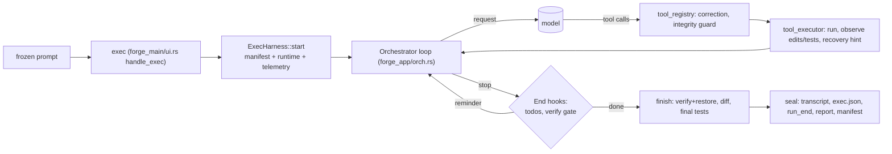

# Peach Ice Tea — architecture

Peach Ice Tea is a coding-agent harness built on a fork of ForgeCode (`tailcallhq/forgecode`, Rust; D-001,
D-024). This document answers the HACKATHON.md §25 interview questions. Each answer names the code that
implements it, the telemetry field that shows it happening, and the decision record behind it (D-*, in
`docs/harness/DECISIONS.md`).

**Evidence status (honest):** most behaviour is proven by end-to-end tests that drive the real binary with a
scripted model (`crates/forge_main/tests/exec_scripted_model.rs`, `exec_integrity.rs`, `exec_never_blocks.rs`).
Live Gemini runs so far: D-032 (a correct fix, stopped by a cost cap we set) and D-040 (the free-tier quota
was exhausted before the first call). Live DeepSeek-on-NVIDIA runs are D-043.

## Orchestration

- **How is the next step decided?** The model decides; the harness bounds and corrects. Each iteration of
  `Orchestrator::run` sends the context, runs the requested tools (read-only runs may be concurrent behind
  `FORGE_HARNESS_PARALLEL_READONLY`, D-041), appends the results and loops. Telemetry: `model_call` with
  `tool_call_ids`, and `tool_call` with `origin_call_id` pointing back to the model call that asked for it.
- **How is completion decided?** When the model stops with no tool calls, the End hooks run. Pending todos
  (upstream) and the **verification gate** (`hooks/verify_gate.rs`, D-037) can send it back: an edit with no
  passing test run since gets a reminder, at most twice, and after that `agent_state: verification_unconfirmed`
  is recorded. The gate acts only on voluntary stops, so limits still end runs. After the agent stops, the
  harness runs the tests itself (`tests.json`, `test_run` with `origin: harness_final`), so the evidence says
  whether the tests pass, not whether the agent said they did.
- **What happens when stuck?** The upstream doom-loop detector, a tool-failure limit (exit 2), a request limit
  (exit 3), a wall-clock budget (exit 4, D-029) and signal handling (exit 5, D-038) all end the run with a
  full evidence bundle. The run can never block on a person: `followup` is answered in-band and no longer
  ends the turn (D-031).
- **Why this architecture?** Forking kept a mature loop, tools and compaction (D-001). Everything we added is
  in additive modules (`forge_harness`, `forge_app/src/hooks/{telemetry,verify_gate}.rs`, `tool_concurrency.rs`,
  `tool_correction.rs`) with `// harness:` seams in upstream files (D-004).

## Context

- **What enters context?** The agent's system prompt, tool definitions (optionally without worked examples,
  −15.4% per request, D-039), the task with a plain-text protected-test notice prepended (principle 4), and
  tool results. Withheld output is loud and recoverable: truncated output names the file holding the rest
  (T1.1).
- **How is growth prevented?** Upstream compaction (`hooks/compaction.rs`) summarises older turns and keeps the
  reasoning chain. Each compaction emits `context_compaction` (messages and estimated tokens before and after).
  Every model call records `context_tokens_estimated` and `context_messages`.
- **What is compressed or discarded?** Older turns go into a summary. Tool-output bodies above the limits go
  to temp files with a path in the result. Nothing is dropped silently.
- **How is state retained?** Todos, the conversation database, and the evidence bundle's `transcript.json`,
  which is written on every exit path (D-034).

## Tools

- **Why these tools?** Forge's catalog (read, search, write, patch, multi_patch, shell, fetch, todo, task):
  flat schemas with `required` fields, checked for Gemini compatibility (TH.3).
- **How does the model choose?** From the descriptions. The judged profile keeps upstream's full text; compact
  descriptions are an A/B candidate (D-039).
- **How are tool failures handled?** A refused edit to a protected test is returned as a normal result
  with guidance, so it doesn't count toward the failure limit (D-019, PLAN C7) and emits
  `integrity: refused`. Misnamed arguments can be renamed before dispatch behind a flag (D-042,
  `recovery: tool_argument_renamed`). A test run that failed before the code executed (environment,
  compile or timeout) gets a one-line recovery hint and a `recovery` event (D-037).
- **Why this interface?** Stability and the upstream merge path. Changes that alter what the model sees
  ship behind flags until an A/B (principle 6).

## Tokens

- **Where do tokens go?** Measured (D-039): a first Gemini request was 50,773 bytes, of which tools were 38,296
  (`todo_write` alone 11.5 KB, mostly examples) and the system prompt 11,835. Per-call `input_tokens`,
  `cached_tokens`, `output_tokens` and `reasoning_tokens` come from provider usage. Gemini's thinking tokens
  are counted as output (D-026), and DeepSeek's cache hits are read from its own fields (D-036).
- **Avoiding repetition:** provider prompt caching; the report shows `cache_hit_rate`. Also compact tool docs.
- **What controls context size:** compaction thresholds, output truncation, `FORGE_MAX_TOKENS`.
- **Token vs reasoning trade-off:** effort maps to Gemini's `thinkingLevel` (fixed in D-032's pre-run check,
  which found the mapping unwired).

## Reliability

- **Failing tests:** each test run is classified (`passed`, `test_assertion`, `compile`, `environment`,
  `timeout`, `unknown`) with counts parsed from the runner's own summary (`verify/classify.rs`).
- **Distinguishing failure types:** the same classes drive the recovery hints. Retries record their cause
  (`retry.reason`); an empty completion records whether the provider billed it (`usage_reported`, D-033). A
  per-day or billing quota is not retried at all and is named in `exec.json` (D-040).
- **Recovering from wrong implementations:** tests are the specification. The gate and the final run keep a
  wrong fix from passing silently, and the integrity guard keeps "fix the test" off the table: refused at
  dispatch, then verified and restored after the run (D-019, D-028, D-030).

## Architecture

- **Major components:** the upstream loop, tools and providers (`crates/forge_*`). Ours: `forge_harness`
  (integrity, runtime, telemetry + sink with redaction, evidence, report, verify, tool docs); forge_app hooks
  (telemetry, verify gate); `forge_main/src/harness_exec.rs` (the exec lifecycle); the eval suite
  (`benchmarks/hackathon/run.ts`, fixtures, `--agent forge-cheat`).
- **Most important decisions:** enforce in the runtime rather than in prompts (integrity guard, verify gate,
  never-block); evidence on every exit path; objective numbers only, with discrepancies shown rather than
  reconciled (D-035); behaviour changes behind flags until measured.
- **What we would change next cycle:** A/B the four flagged features on the TH.7 suite; make edits made
  through the shell arm the verify gate; meter the title-generation call; vendor the organizers' schemas
  into the adapters (D-020).
