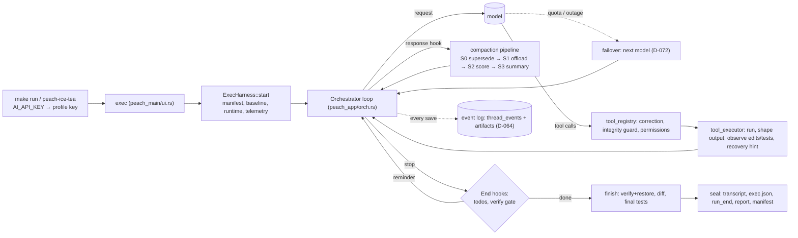

# Peach Ice Tea — architecture

Peach Ice Tea is a coding-agent harness built on a fork of an open-source (Apache-2.0) coding agent (Rust; D-001,
D-024). This document answers the HACKATHON.md §25 interview questions. Each answer names the code that does it,
the decision behind it (D-*, in `docs/harness/DECISIONS.md`), and **what a real run's telemetry shows**.

**The real run cited throughout:** [`documentation/evidence/2026-09-27-make-run-py-bugfix/`](evidence/2026-09-27-make-run-py-bugfix/).
It is the evaluator path (`make run`, D-070) from a clean clone, on the default model
`nvidia/nemotron-3-ultra-550b-a55b:free`, fixing the `py-bugfix` fixture. Outcome `completed`, 5 model calls,
62 s, integrity clean, the harness's own final test run 4 passed / 0 failed. Where a mechanism has not yet
happened in a real run (compaction, failover), the answer says so and names the end-to-end test that drives the
real binary with a scripted model instead.

## Orchestration

- **How is the next step decided?** The model decides; the harness bounds and corrects. Each iteration of
  `Orchestrator::run` sends the context, runs the requested tools, appends results and loops.
  *Real run:* 5 `model_call` events; the first returned two `tool_call_ids`, and both `tool_call` events carry
  `origin_call_id` `…#1` pointing back to it. Every call's `finish_reason` was `tool_calls` until the last
  (`end_turn`).
- **How is completion decided?** When the model stops calling tools, the End hooks run. The **verification gate**
  (`hooks/verify_gate.rs`, D-037) sends an agent that edited without a passing test run back, at most twice. After
  it stops, the harness runs the tests itself. *Real run:* `test_run` with `origin: agent`, `exit_code: 0`,
  `passed: 4`, then `test_run` with `origin: harness_final`, `passed: 4, failed: 0`. The report's pass/fail comes
  from the second, not from the agent's claim.
- **What happens when stuck?** The doom-loop detector, the tool-failure limit (exit 2), the request limit (exit 3),
  the wall-clock budget (exit 4) and signals (exit 5) all end the run with a full evidence bundle; SIGKILL leaves a
  provisional `incomplete` manifest and the restore baseline (D-056). Nothing can wait on a person: `followup`, MCP
  trust, permission confirms and "continue anyway?" are answered or refused without asking (D-031, D-048, D-053).
  If the model's provider gives out (an exhausted quota, or an outage that outlasts the retries), the run continues
  on the next model of the profile's fallback list (`recovery: model_failover`, D-072). *No real run has needed
  failover yet;* `exec_scripted_model.rs` proves it with a real 402 body and with 503s.
- **Why this architecture?** Forking kept a mature loop, tools and providers (D-001). Everything added lives in
  additive modules (`peach_harness`, `peach_app/src/{compaction_pipeline,hooks,truncation,model_failover}`,
  `peach_repo/src/thread_event`) with `// harness:` seams in upstream files (D-004).

## Context

- **What enters context?** The system prompt, tool definitions, the task with a plain-text protected-files notice
  prepended (principle 4), `AGENTS.md` and `.peach/memory.md` if present (D-067), and tool results.
  *Real run:* `context_composition` at the first request: `system_prompt` 2,901 tokens, `tool_definitions` 9,497,
  `user_prompt` 238. Tool definitions are three quarters of the fixed cost (D-039's byte measurement said the same).
- **How is growth prevented?** A staged compaction pipeline (`compaction_pipeline`, D-062). The cheap, reversible
  stages run first, and the lossy summary only if still needed:
  - S0 supersedes stale results (D-075);
  - S1 offloads large old results to handles (D-074);
  - S2 cuts by relevance score (D-077);
  - S3 is peach's summary.

  A soft trigger at ¾ of the threshold runs only S0–S1 (D-076). All of these are flagged until an A/B; the default
  is S3 alone, identical to upstream (golden test). *Real run:* 14,086 estimated context tokens at the last call,
  below the threshold, so **no real run has compacted yet**. The stages are proven end to end with a scripted model
  (in each case the stub reaches the model and no summary runs).
- **What is compressed or discarded?** Nothing silently. Every cut leaves a stub saying what was cut and
  `read <path> (the complete output)`, and reading it counts as `offload_read` (D-060). Summarised-away results
  can be listed with handles (D-066), and an exact handoff note can top the summary (D-063).
- **How is state retained?** Todos; `conversations.context` as the working view; and an **append-only event log**
  that keeps every message a compaction removed (`thread_events` + content-addressed `artifacts`, D-064/D-065). The
  evidence bundle's `transcript.json` is written on every exit path (D-034).

## Tools

- **Why these tools?** Peach's catalog (read, fs_search, write, patch, multi_patch, shell, fetch, todo, task): flat
  schemas with `required` fields (T0.8), checked for Gemini compatibility (TH.3). We added no tools: recall reuses
  `read` on handle files (D-066; HACKATHON §21, "more tools ≠ better").
- **How does the model choose?** From the descriptions. *Real run:* `read` ×2 (both requested in one model call; run in order, since parallel reads are a flag, D-041),
  `patch` ×1, `shell` ×2. Every edit came after a read (`behaviour.ts`, D-078).
- **How are tool failures handled?** A refused edit to a protected test is a normal result with guidance
  (`integrity: refused`). Misnamed arguments can be renamed before dispatch (flag, D-042). Across every real run
  so far, the default model made **0 tool errors in 67 calls** (`benchmarks/reports/tools/`, D-079).
- **Why this interface?** Stability and the upstream merge path. Anything that changes what the model sees ships
  behind a flag until an A/B (principle 6).

## Tokens

- **Where do tokens go?** *Real run:* 66,960 input tokens over 5 calls (12,185 → 14,172 per call as the transcript
  grew), 870 output, of which 218 were reasoning, all from provider usage, never from the model (§16). Most of each
  request is the fixed prefix above.
- **Avoiding repetition:** the provider's prompt cache. *Real run:* `cached_tokens` 0, 0, 4,320, 8,640, 8,640, so
  the fixed prefix was served from cache from the third call on, for a report `cache_hit_rate` of 32%. The report
  also shows the cache rate just before and after each compaction (D-076), because a compaction invalidates the
  prefix.
- **What controls context size:** compaction thresholds and stages, output truncation with handles, and noise
  compression for build/test output (flag, D-073).
- **Token vs reasoning trade-off:** reasoning effort is set per profile. Gemini's thinking level is mapped (TH.3),
  and reasoning tokens are counted as output (D-026).

## Reliability

- **Failing tests:** every test run is classified (`passed`, `test_assertion`, `compile`, `environment`, `timeout`)
  with counts parsed from the runner's own summary (`verify/classify.rs`).
- **Distinguishing failure types — a real example:** the agent first ran `python -m pytest`, but pytest was not
  installed. The harness recorded `test_run {exit_code: 1, failure_class: environment}` and added a one-line hint
  (`recovery {action: recovery_hint, trigger: environment}`). The agent's next call used
  `python3 -m unittest discover`, which passed 4/0. An assertion failure gets no hint, because its output speaks
  for itself (D-037).
- **Recovering from wrong implementations:** tests are the specification. The gate and the harness's own final
  run keep a wrong fix from passing silently. The integrity guard keeps "fix the test" off the table: refused at
  dispatch, verified and restored after the run, including test sections of `package.json`/`pyproject.toml`
  (D-054). *Real run:* `integrity: verify — 2 protected files checked; all unchanged`.

## Architecture

- **Major components:**
  - the upstream loop, tools and providers (`crates/peach_*`);
  - `peach_harness`: integrity, runtime, telemetry with redaction, evidence, report, verification, the relevance
    scorer;
  - `peach_app`: hooks, the compaction pipeline, output shaping, failover;
  - `peach_repo::thread_event`: the event log;
  - `peach_main/src/harness_exec.rs`: the exec lifecycle;
  - the root `Makefile` and `harness/` entry points;
  - the evaluation tooling: `benchmarks/hackathon` (suite, runner, A/B, bake-off, behaviour and tool-error
    reports).
- **Most important decisions:** enforce in the runtime, not in prompts; evidence on every exit path; objective
  numbers only; any model, chosen by evidence per role (D-049, MM.3), on the free tier (D-069); behaviour changes
  behind flags until measured.
- **What we would change next cycle:** run the pending A/Bs on two model families (they wait on the free-tier
  budget, D-069) and flip the flags that hold; a long-horizon suite so compaction is exercised by real runs;
  `LlmScorer` when a model request per compaction is affordable (D-077).
